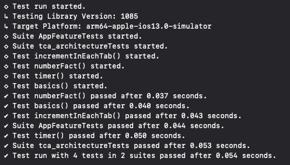

# TCA Chapter 1 – Essentials Study - Counter Facts App

<a href="https://github.com/pointfreeco/swift-composable-architecture">
  
</a>


## Objective

This repository serves as:

- A reference implementation of Composable Architecture (TCA) Essentials study tutorial
- A study case for feature actions and side effects
- A practical guide for testing  actions and side effects

---

## Extra Insight

> Action routing and effect cancellation are automatically scoped by identity through `IdentifiedArrayOf` and `ForEachStore`, removing the need for manual ID management.

| Increment | Start Timer | Stop Timer | FactTapped |
|--------|------|--------|--------|
|  |  |  |  |

## Overview

This repository contains my hands-on study of **The Composable Architecture (TCA)** fundamentals, based on the **Chapter 1 – Essentials** tutorial.

https://swiftpackageindex.com/pointfreeco/swift-composable-architecture/main/tutorials/meetcomposablearchitecture

> "Explore the basics of creating a new feature in the Composable Architecture, layering on side effects, and writing a complete test suite for the feature."

Official TCA Swift Package Manager (SPM):

https://github.com/pointfreeco/swift-composable-architecture

## About The Composable Architecture (TCA)

The Composable Architecture is a library for building applications in a consistent and predictable way, emphasizing:

- Centralized and explicit state management
- Clear action-driven data flow
- Isolation and composition of features
- High testability of business logic

Each feature is composed of:

- **State**: Source of truth for UI and logic
- **Action**: All possible user and system events
- **Reducer**: Pure function that handles state transitions
- **Effects**: Side effects and asynchronous operations

---

## Scope of This Implementation

The project walks through the core building blocks of TCA by implementing a **Counter feature** enhanced with **Number Fact requests**, following each step of the official learning path:

- **Your First Feature**
- **Adding Side Effects**
- **Testing Your Feature**
- **Composing Features**

Each stage evolves the architecture, reinforcing key concepts such as state management, action handling, effects, and modular composition.

---

## Features Implemented

## Feature Composition Diagram (TCA)
### 1. Composition Layer (Feature Hierarchy)
```swift
tca_architectureApp (Root)
└── AppFeature (View)
    └── ForEachStore (IdentifiedArrayOf)
        └── CounterFeature (Scoped by ID)
```
### 2. CounterFeature Domain
```swift
CounterFeature
├── State
│   ├── id: UUID
│   ├── count: Int
│   ├── fact: String?
│   ├── isLoading: Bool
│   └── isTimerRunning: Bool
│
├── Action
│   ├── decrementButtonTapped
│   ├── incrementButtonTapped
│   ├── factButtonTapped
│   ├── factClientResponse(String)
│   ├── toggleTimerButtonTapped
│   └── timerTick
│
└── Reducer
    ├── State mutations
    └── Effect handling
```
### 3. Dependencies (Side Effects)
```swift
CounterFeature
└── Dependencies
    ├── numberFactClient
    │   └── fact(Int) async throws -> String
    └── continuousClock (for timer effects)
```

### Counter Feature
- Increment / decrement logic
- Async number fact fetching
- Cancellation of in-flight effects

### Side Effects
- Integration with a number fact client
- Proper handling of async effects using TCA dependencies

### Testing
- Full test coverage using `TestStore`
- Validation of state mutations and effect handling
- Deterministic testing of async flows

### Feature Composition
- Multiple counters rendered dynamically
- Scoped state and actions per feature instance

---

## Improvements Over the Original Tutorial

While following the tutorial, I identified and fixed a subtle bug:

### Issue
When instantiating multiple `CounterFeature` instances (e.g., in tabs), triggering a **cancel action** in one feature would unintentionally affect another.

### Solution
- Introduced a unique `UUID` identifier for each `CounterFeature` instance
- Ensured proper isolation of side effects and cancellations per feature

---

## Advanced Composition

To further improve scalability and reduce manual wiring:

- Replaced static state management with:
  - `IdentifiedArrayOf<CounterFeature.State>`
  - `IdentifiedActionOf<CounterFeature.Action>`

- Leveraged TCA's built-in scoping mechanisms using `ForEach`

### Result

- No need to manually track or pass feature IDs when dispatching actions
- Automatic routing of actions to the correct feature instance
- Safer and cleaner architecture for dynamic collections of features

---

## Architecture Highlights

- Unidirectional data flow
- Strongly typed state and actions
- Dependency injection via TCA
- Testable side effects
- Scalable feature composition

---

## Testing

<html>
 
</html>

## Goals of This Study

- Master TCA fundamentals
- Understand effect management and cancellation
- Build confidence in writing deterministic tests
- Explore scalable patterns for feature composition

---

## Contributions

This is a personal study repository, but feel free to explore, fork, or suggest improvements.

---

## References

- TCA Repository: https://github.com/pointfreeco/swift-composable-architecture
- Official Tutorial: https://swiftpackageindex.com/pointfreeco/swift-composable-architecture/main/tutorials/meetcomposablearchitecture

---

## Final Thoughts

This project reflects not just the tutorial steps, but also practical refinements to make TCA more robust in real-world scenarios—especially when dealing with multiple feature instances and effect isolation.

If you’re diving into TCA, this repo aims to serve as both a guide and a sandbox for experimentation.
